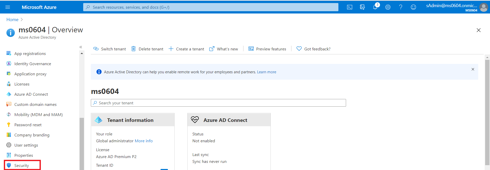
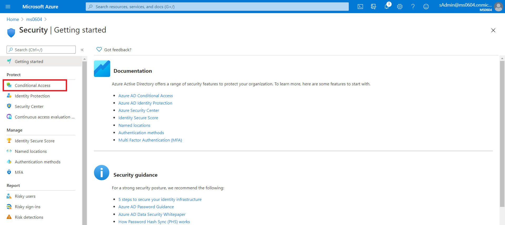
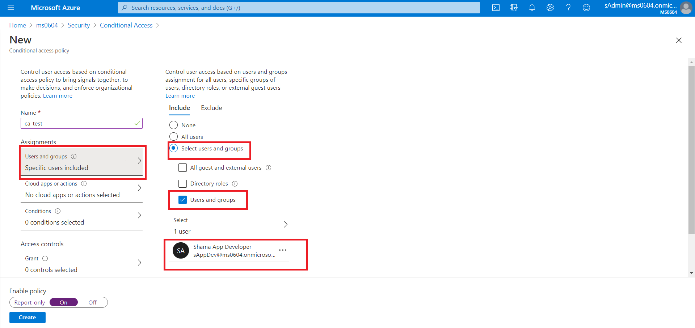
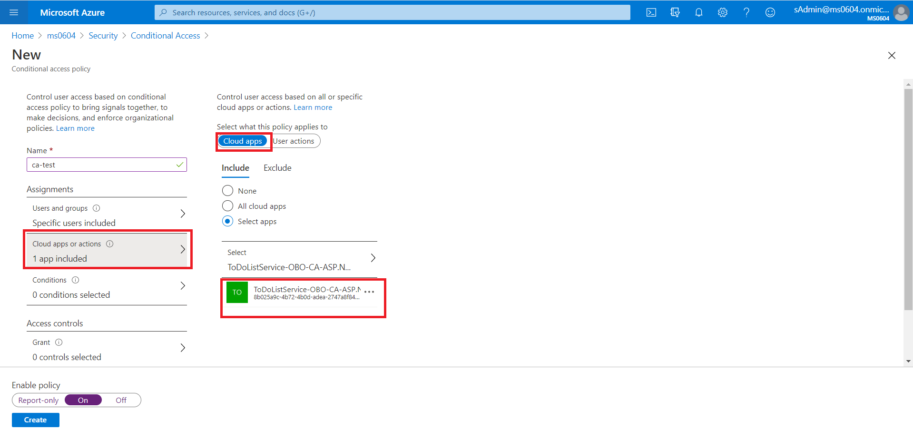
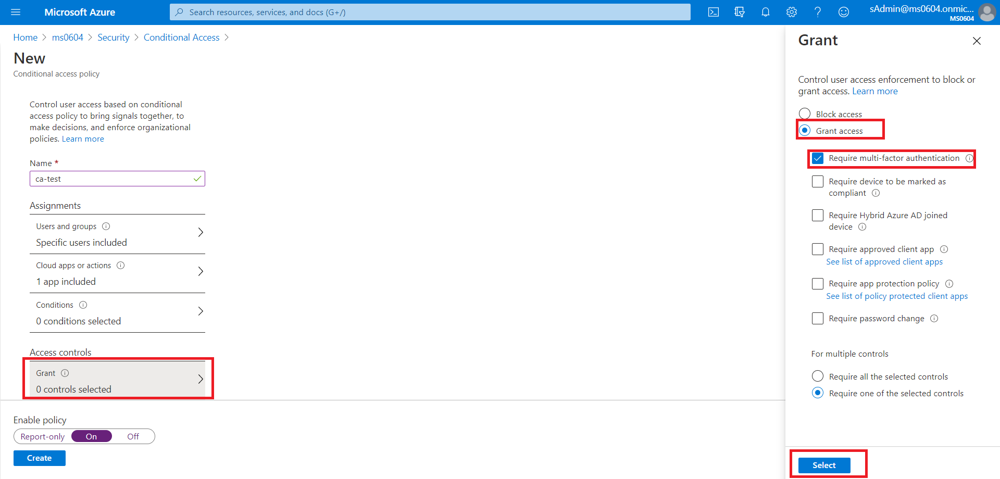
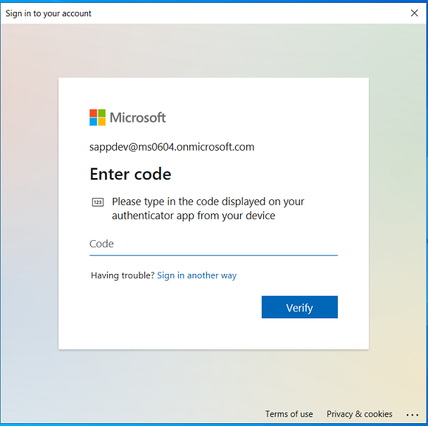
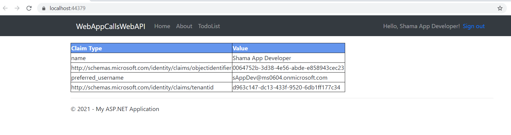
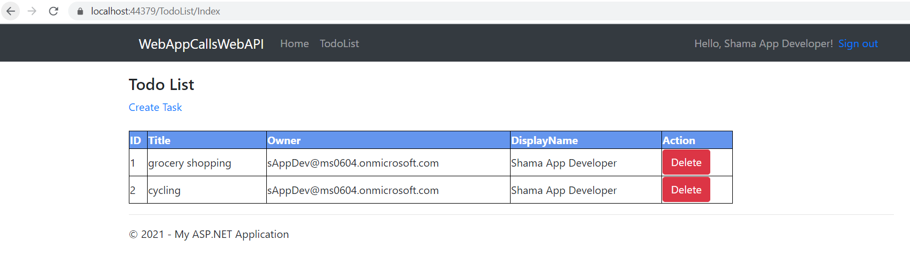

# Sign-in a user with the Microsoft Identity Platform and call an ASP.NET web API that calls a downstream Web API with Conditional Access

 1. [Overview](#overview)
 1. [Scenario](#scenario)
 1. [Contents](#contents)
 1. [Prerequisites](#prerequisites)
 1. [Setup](#setup)
 1. [Registration](#registration)
 1. [Running the sample](#running-the-sample)
 1. [Explore the sample](#explore-the-sample)
 1. [About the code](#about-the-code)
 1. [Deployment](#deployment)
 1. [More information](#more-information)
 1. [Community Help and Support](#community-help-and-support)
 1. [Contributing](#contributing)


## Overview

This sample demonstrates a .NET web App and native client calling a .NET web API that is secured using Azure AD. Further on the API will also call a downstream API on-behalf of the signed-in user. The downstream web API will have a Conditional Access policy applied that requires Multiple Factors Authentication (MFA).

This sample is built on the core [active-directory-dotnet-webapi-onbehalfof](https://github.com/Azure-Samples/active-directory-dotnet-webapi-onbehalfof) but adds support for conditional access.

## Scenario

As in that sample, the native client and a .NET web application:

1. Uses the Microsoft Authentication Library (MSAL) to sign-in and obtain a JWT access token from **Azure AD**.
1. The access token is used as a bearer token to authorize the user to call the .NET web API protected **Azure AD**.
1. Calls the ASP.NET Web API(`TodoListService`) by using the access token as a bearer token in the authentication header of the Http request.

The web API:

1. Calls another downstream Web API ([The Microsoft Graph](https://graph.microsoft.com))
1. This sample then extends the features of the [active-directory-dotnet-webapi-onbehalfof](https://github.com/Azure-Samples/active-directory-dotnet-webapi-onbehalfof) sample where the `TodoListService` Web API calls a downstream service, which requires conditional access. Therefore the intermediate service (`TodoListService`) needs to propagate to its clients the need to process additional claims (for instance to carry out  two factor authentication).


## Prerequisites

- [Visual Studio](https://visualstudio.microsoft.com/downloads/)
- An **Azure AD** tenant. For more information see: [How to get an Azure AD tenant](https://docs.microsoft.com/azure/active-directory/develop/quickstart-create-new-tenant)
- A user account in your **Azure AD** tenant. This sample will not work with a **personal Microsoft account**. Therefore, if you signed in to the [Azure portal](https://portal.azure.com) with a personal account and have never created a user account in your directory before, you need to do that now.

## Setup

### Step 1: Clone or download this repository

From your shell or command line:

```console
    git clone https://github.com/Azure-Samples/active-directory-dotnet-webapi-onbehalfof-ca.git
```

or download and extract the repository .zip file.

> :warning: To avoid path length limitations on Windows, we recommend cloning into a directory near the root of your drive.

### Register the sample application(s) with your Azure Active Directory tenant

There are four projects in this sample. Each needs to be separately registered in your Azure AD tenant. To register these projects, you can:

- follow the steps below for manually register your apps
- or use PowerShell scripts that:
  - **automatically** creates the Azure AD applications and related objects (passwords, permissions, dependencies) for you.
  - modify the projects' configuration files.

<details>
  <summary>Expand this section if you want to use this automation:</summary>

> :warning: If you have never used **Azure AD Powershell** before, we recommend you go through the [App Creation Scripts](./AppCreationScripts/AppCreationScripts.md) once to ensure that your environment is prepared correctly for this step.

1. On Windows, run PowerShell as **Administrator** and navigate to the root of the cloned directory
1. If you have never used Azure AD Powershell before, we recommend you go through the [App Creation Scripts](./AppCreationScripts/AppCreationScripts.md) once to ensure that your environment is prepared correctly for this step.
1. In PowerShell run:

   ```PowerShell
   Set-ExecutionPolicy -ExecutionPolicy RemoteSigned -Scope Process -Force
   ```

1. Run the script to create your Azure AD application and configure the code of the sample application accordingly.
1. In PowerShell run:

   ```PowerShell
   cd .\AppCreationScripts\
   .\Configure.ps1
   ```

   > Other ways of running the scripts are described in [App Creation Scripts](./AppCreationScripts/AppCreationScripts.md)
   > The scripts also provide a guide to automated application registration, configuration and removal which can help in your CI/CD scenarios.

</details>

### Choose the Azure AD tenant where you want to create your applications

As a first step you'll need to:

1. Sign in to the [Azure portal](https://portal.azure.com).
1. If your account is present in more than one Azure AD tenant, select your profile at the top right corner in the menu on top of the page, and then **switch directory** to change your portal session to the desired Azure AD tenant.

### Register the service app (ToDoListService-OBO-CA-ASP.NET)

1. Navigate to the [Azure portal](https://portal.azure.com) and select the **Azure AD** service.
1. Select the **App Registrations** blade on the left, then select **New registration**.
1. In the **Register an application page** that appears, enter your application's registration information:
   - In the **Name** section, enter a meaningful application name that will be displayed to users of the app, for example `ToDoListService-OBO-CA-ASP.NET`.
   - Under **Supported account types**, select **Accounts in this organizational directory only**.
1. Select **Register** to create the application.
1. In the app's registration screen, find and note the **Application (client) ID**. You use this value in your app's configuration file(s) later in your code.
1. Select **Save** to save your changes.
1. In the app's registration screen, select the **Expose an API** blade to the left to open the page where you can declare the parameters to expose this app as an API for which client applications can obtain [access tokens](https://docs.microsoft.com/azure/active-directory/develop/access-tokens) for.
The first thing that we need to do is to declare the unique [resource](https://docs.microsoft.com/azure/active-directory/develop/v2-oauth2-auth-code-flow) URI that the clients will be using to obtain access tokens for this Api. To declare an resource URI, follow the following steps:
   - Select `Set` next to the **Application ID URI** to generate a URI that is unique for this app.
   - For this sample, accept the proposed Application ID URI (`api://{clientId}`) by selecting **Save**.
1. All APIs have to publish a minimum of one [scope](https://docs.microsoft.com/azure/active-directory/develop/v2-oauth2-auth-code-flow#request-an-authorization-code) for the client's to obtain an access token successfully. To publish a scope, follow the following steps:
   - Select **Add a scope** button open the **Add a scope** screen and Enter the values as indicated below:
        - For **Scope name**, use `access_as_user`.
        - Select **Admins and users** options for **Who can consent?**.
        - For **Admin consent display name** type `Access ToDoListService-OBO-CA-ASP.NET`.
        - For **Admin consent description** type `Allows the app to access ToDoListService-OBO-CA-ASP.NET as the signed-in user.`
        - For **User consent display name** type `Access ToDoListService-OBO-CA-ASP.NET`.
        - For **User consent description** type `Allow the application to access ToDoListService-OBO-CA-ASP.NET on your behalf.`
        - Keep **State** as **Enabled**.
        - Select the **Add scope** button on the bottom to save this scope.

#### Configure the service app (ToDoListService-OBO-CA-ASP.NET) to use your app registration

Open the project in your IDE (like Visual Studio or Visual Studio Code) to configure the code.

> In the steps below, "ClientID" is the same as "Application ID" or "AppId".

1. Open the `TodoListService\Web.config` file.
1. Find the key `ida:TenantId` and replace the existing value with your Azure AD tenant ID.
1. Find the key `ida:ClientID` and replace the existing value with the application ID (clientId) of `ToDoListService-OBO-CA-ASP.NET` app copied from the Azure portal.
1. Find the key `ida:ClientSecret` and replace the existing value with the key you saved during the creation of `ToDoListService-OBO-CA-ASP.NET` copied from the Azure portal.
1. Find the key `ida:CAProtectedResourceScope` and replace the existing value with Scope.

### Register the service app (ToDoListService-ASP.NET)

1. Navigate to the [Azure portal](https://portal.azure.com) and select the **Azure AD** service.
1. Select the **App Registrations** blade on the left, then select **New registration**.
1. In the **Register an application page** that appears, enter your application's registration information:
   - In the **Name** section, enter a meaningful application name that will be displayed to users of the app, for example `ToDoListService-ASP.NET`.
   - Under **Supported account types**, select **Accounts in this organizational directory only**.
1. Select **Register** to create the application.
1. In the app's registration screen, find and note the **Application (client) ID**. You use this value in your app's configuration file(s) later in your code.
1. Select **Save** to save your changes.
1. In the app's registration screen, select the **Certificates & secrets** blade in the left to open the page where we can generate secrets and upload certificates.
1. In the **Client secrets** section, select **New client secret**:
   - Type a key description (for instance `app secret`),
   - Select one of the available key durations (**In 1 year**, **In 2 years**, or **Never Expires**) as per your security posture.
   - The generated key value will be displayed when you select the **Add** button. Copy the generated value for use in the steps later.
   - You'll need this key later in your code's configuration files. This key value will not be displayed again, and is not retrievable by any other means, so make sure to note it from the Azure portal before navigating to any other screen or blade.
1. In the app's registration screen, select the **API permissions** blade in the left to open the page where we add access to the APIs that your application needs.
   - Select the **Add a permission** button and then,
   - Ensure that the **My APIs** tab is selected.
   - In the list of APIs, select the API `ToDoListService-OBO-CA-ASP.NET`.
   - In the **Delegated permissions** section, select the **Access 'ToDoListService-OBO-CA-ASP.NET'** in the list. Use the search box if necessary.
   - Select the **Add permissions** button at the bottom.
   - Select the **Add a permission** button and then:
   - Ensure that the **Microsoft APIs** tab is selected.
   - In the *Commonly used Microsoft APIs* section, select **Microsoft Graph**
   - In the **Delegated permissions** section, select the **User.Read** in the list. Use the search box if necessary.
   - Select the **Add permissions** button at the bottom.
1. In the app's registration screen, select the **Expose an API** blade to the left to open the page where you can declare the parameters to expose this app as an API for which client applications can obtain [access tokens](https://docs.microsoft.com/azure/active-directory/develop/access-tokens) for.
The first thing that we need to do is to declare the unique [resource](https://docs.microsoft.com/azure/active-directory/develop/v2-oauth2-auth-code-flow) URI that the clients will be using to obtain access tokens for this Api. To declare an resource URI, follow the following steps:
   - Select `Set` next to the **Application ID URI** to generate a URI that is unique for this app.
   - For this sample, accept the proposed Application ID URI (`api://{clientId}`) by selecting **Save**.
1. All APIs have to publish a minimum of one [scope](https://docs.microsoft.com/azure/active-directory/develop/v2-oauth2-auth-code-flow#request-an-authorization-code) for the client's to obtain an access token successfully. To publish a scope, follow the following steps:
   - Select **Add a scope** button open the **Add a scope** screen and Enter the values as indicated below:
        - For **Scope name**, use `access_as_user`.
        - Select **Admins and users** options for **Who can consent?**.
        - For **Admin consent display name** type `Access ToDoListService-ASP.NET`.
        - For **Admin consent description** type `Allows the app to access ToDoListService-ASP.NET as the signed-in user.`
        - For **User consent display name** type `Access ToDoListService-ASP.NET`.
        - For **User consent description** type `Allow the application to access ToDoListService-ASP.NET on your behalf.`
        - Keep **State** as **Enabled**.
        - Select the **Add scope** button on the bottom to save this scope.

#### Configure the service app (ToDoListService-ASP.NET) to use your app registration

Open the project in your IDE (like Visual Studio or Visual Studio Code) to configure the code.

> In the steps below, "ClientID" is the same as "Application ID" or "AppId".

1. Open the `TodoListService\Web.config` file.
1. Find the key `ida:TenantId` and replace the existing value with your Azure AD tenant ID.
1. Find the key `ida:ClientID` and replace the existing value with the application ID (clientId) of `ToDoListService-OBO-CA-ASP.NET` app copied from the Azure portal.
1. Find the key `ida:ClientSecret` and replace the existing value with the key you saved during the creation of `ToDoListService-OBO-CA-ASP.NET` copied from the Azure portal.
1. Find the key `ida:CAProtectedResourceScope` and replace the existing value with Scope.

### Register the client app (TodoListClient)

1. Navigate to the [Azure portal](https://portal.azure.com) and select the **Azure AD** service.
1. Select the **App Registrations** blade on the left, then select **New registration**.
1. In the **Register an application page** that appears, enter your application's registration information:
   - In the **Name** section, enter a meaningful application name that will be displayed to users of the app, for example `TodoListClient`.
   - Under **Supported account types**, select **Accounts in this organizational directory only**.
1. Select **Register** to create the application.
1. In the app's registration screen, find and note the **Application (client) ID**. You use this value in your app's configuration file(s) later in your code.
1. In the app's registration screen, select **Authentication** in the menu.
   - If you don't have a platform added, select **Add a platform** and select the **Public client (mobile & desktop)** option.
   - In the **Redirect URIs** | **Suggested Redirect URIs for public clients (mobile, desktop)** section, select **https://login.microsoftonline.com/common/oauth2/nativeclient**
1. Select **Save** to save your changes.
1. In the app's registration screen, select the **API permissions** blade in the left to open the page where we add access to the APIs that your application needs.
   - Select the **Add a permission** button and then,
   - Ensure that the **My APIs** tab is selected.
   - In the list of APIs, select the API `ToDoListService-ASP.NET`.
   - In the **Delegated permissions** section, select the **Access 'ToDoListService-ASP.NET'** in the list. Use the search box if necessary.
   - Select the **Add permissions** button at the bottom.

#### Configure the client app (TodoListClient) to use your app registration

Open the project in your IDE (like Visual Studio or Visual Studio Code) to configure the code.

> In the steps below, "ClientID" is the same as "Application ID" or "AppId".

1. Open the `TodoListClient\App.config` file.
1. Find the key `ida:TenantId` and replace the existing value with your Azure AD tenant ID.
1. Find the key `ida:ClientId` and replace the existing value with the application ID (clientId) of `TodoListClient` app copied from the Azure portal.
1. Find the key `todo:TodoListServiceScope` and replace the existing value with default API scope.

### Register the web app (TodoListWebApp-aspnet)

1. Navigate to the [Azure portal](https://portal.azure.com) and select the **Azure AD** service.
1. Select the **App Registrations** blade on the left, then select **New registration**.
1. In the **Register an application page** that appears, enter your application's registration information:
   - In the **Name** section, enter a meaningful application name that will be displayed to users of the app, for example `TodoListWebApp-aspnet`.
   - Under **Supported account types**, select **Accounts in this organizational directory only**.
   - In the **Redirect URI (optional)** section, select **Web** in the combo-box and enter the following redirect URI: `https://localhost:44379/`.
     > Note that there are more than one redirect URIs used in this sample. You'll need to add them from the **Authentication** tab later after the app has been created successfully.
1. Select **Register** to create the application.
1. In the app's registration screen, find and note the **Application (client) ID**. You use this value in your app's configuration file(s) later in your code.
1. In the app's registration screen, select **Authentication** in the menu.
   - If you don't have a platform added, select **Add a platform** and select the **Web** option.
   - In the **Redirect URIs** section, enter the following redirect URIs.
      - `https://localhost:44379/signin-oidc`
   - In the **Logout URL** section, set it to `https://localhost:44379/signout-oidc`.
1. Select **Save** to save your changes.
1. In the app's registration screen, select the **Certificates & secrets** blade in the left to open the page where we can generate secrets and upload certificates.
1. In the **Client secrets** section, select **New client secret**:
   - Type a key description (for instance `app secret`),
   - Select one of the available key durations (**In 1 year**, **In 2 years**, or **Never Expires**) as per your security posture.
   - The generated key value will be displayed when you select the **Add** button. Copy the generated value for use in the steps later.
   - You'll need this key later in your code's configuration files. This key value will not be displayed again, and is not retrievable by any other means, so make sure to note it from the Azure portal before navigating to any other screen or blade.
1. In the app's registration screen, select the **API permissions** blade in the left to open the page where we add access to the APIs that your application needs.
   - Select the **Add a permission** button and then,
   - Ensure that the **My APIs** tab is selected.
   - In the list of APIs, select the API `ToDoListService-ASP.NET`.
   - In the **Delegated permissions** section, select the **Access 'ToDoListService-ASP.NET'** in the list. Use the search box if necessary.
   - Select the **Add permissions** button at the bottom.

#### Configure the web app (TodoListWebApp-aspnet) to use your app registration

Open the project in your IDE (like Visual Studio or Visual Studio Code) to configure the code.

> In the steps below, "ClientID" is the same as "Application ID" or "AppId".

1. Open the `TodoListWebApp\Web.config` file.
1. Find the key `ida:TenantId` and replace the existing value with your Azure AD tenant ID.
1. Find the key `ida:ClientId` and replace the existing value with the application ID (clientId) of `TodoListWebApp-aspnet` app copied from the Azure portal.
1. Find the key `ida:ClientSecret` and replace the existing value with the key you saved during the creation of `TodoListWebApp-aspnet` copied from the Azure portal.
1. Find the key `ida:TodoListServiceScope` and replace the existing value with default API scope.

#### Configure Known Client Applications for service (ToDoListService-ASP.NET)

For a middle tier Web API (`ToDoListService-ASP.NET`) to be able to call a downstream Web API, the middle tier app needs to be granted the required permissions as well.
However, since the middle tier cannot interact with the signed-in user, it needs to be explicitly bound to the client app in its **Azure AD** registration.
This binding merges the permissions required by both the client and the middle tier Web Api and presents it to the end user in a single consent dialog. The user then consent to this combined set of permissions.

To achieve this, you need to add the **Application Id** of the client app, in the Manifest of the Web API in the `knownClientApplications` property. Here's how:

1. In the [Azure portal](https://portal.azure.com), navigate to your `ToDoListService-ASP.NET` app registration, and select **Manifest** section.
1. In the manifest editor, change the `"knownClientApplications": []` line so that the array contains 
   the Client IDs of the client applications (`ToDoListService-ASP.NET`, `TodoListClient`, `TodoListWebApp-aspnet`) as elements of the array.

    For instance:

    ```json
    "knownClientApplications": ["ca8dca8d-f828-4f08-82f5-325e1a1c6428"],
    ```

1. **Save** the changes to the manifest.

### Create and link a Conditional Access Policy

1. Inside the **Azure Active Directory** window, select the **Conditional Access** button near the bottom of the list under **Security**.

    

    

1. Select **New Policy** and name your policy.

    

1. Select the **Users and groups** button, choose **Select users and groups** in the **Include** tab.

    

1. Select the **Cloud apps**, then hit the **Select apps** radio button in the **Include** tab, and select the `ToDoListService-OBO-CA-ASP.NET`.

    

1. Finally, select the **Grant** button and hit **Grant access**. Then check the **Require multi-factor authentication** option.

    

1. Enable the policy and save. Access to your web API now requires **multi-factor authentication**!

## Running the sample

> For Visual Studio Users
>
> Clean the solution, rebuild the solution, and run it.  You might want to go into the solution properties and set both projects as startup projects, with the service project starting first.

## Explore the sample

### Explore by using native client

1. **Sign in** using Azure AD credentials. When the user signs-in for the first time , a consent screen is presented. This consent screen lets the user consent for the application to access the web API. After sign-in, you can add items to the To Do list.  The ToDo list service will take the user's access token, passed from the client, and use it to perform the On-Behalf-Of flow to access the Microsoft Graph API.

    
1. If you hit the `Satisfy CA` button, the client app will do the same as above except the downstream API is not Graph.  In this case, it will request a token to the downstream web API with Conditional Access applied. The middle tier will encounter an error when attempting On-Behalf-Of, and will return back state in the `claims` parameter so the client can step up. The user will then be prompted to do MFA.

    

### Explore by using web app

1. Open your browser and navigate to `https://localhost:44318`.
1. **Sign in** using Azure AD credentials. When the user signs-in for the first time , a consent screen is presented. This consent screen lets the user consent for the application to access the web API.

    You will see claims from the signed-in user's token.

   
1. Select ToDoList from navigation bar and you can create or delete the todo list items.

   

> :information_source: Did the sample not work for you as expected? Then please reach out to us using the [GitHub Issues](../../../issues) page.

## We'd love your feedback!

Were we successful in addressing your learning objective? Consider taking a moment to [share your experience with us](Enter_Survey_Form_Link).

## About the code

> - Describe where the code uses auth libraries, or calls the graph
> - Describe specific aspects (e.g. caching, validation etc.)

## More information

- [Microsoft identity platform (Azure Active Directory for developers)](https://docs.microsoft.com/azure/active-directory/develop/)
- [Overview of Microsoft Authentication Library (MSAL)](https://docs.microsoft.com/azure/active-directory/develop/msal-overview)
- [Quickstart: Register an application with the Microsoft identity platform (Preview)](https://docs.microsoft.com/azure/active-directory/develop/quickstart-register-app)
- [Quickstart: Configure a client application to access web APIs (Preview)](https://docs.microsoft.com/azure/active-directory/develop/quickstart-configure-app-access-web-apis)
- [Understanding Azure AD application consent experiences](https://docs.microsoft.com/azure/active-directory/develop/application-consent-experience)
- [Understand user and admin consent](https://docs.microsoft.com/azure/active-directory/develop/howto-convert-app-to-be-multi-tenant#understand-user-and-admin-consent)
- [Application and service principal objects in Azure Active Directory](https://docs.microsoft.com/azure/active-directory/develop/app-objects-and-service-principals)
- [National Clouds](https://docs.microsoft.com/azure/active-directory/develop/authentication-national-cloud#app-registration-endpoints)
- [MSAL code samples](https://docs.microsoft.com/azure/active-directory/develop/sample-v2-code)
    // Add MSAL.NET and/or Identity.Web Docs

For more information about how OAuth 2.0 protocols work in this scenario and other scenarios, see [Authentication Scenarios for Azure AD](https://docs.microsoft.com/azure/active-directory/develop/authentication-flows-app-scenarios).

## Community Help and Support

Use [Stack Overflow](http://stackoverflow.com/questions/tagged/msal) to get support from the community.
Ask your questions on Stack Overflow first and browse existing issues to see if someone has asked your question before.
Make sure that your questions or comments are tagged with [`azure-active-directory` `azure-ad-b2c` `ms-identity` `adal` `msal`].

If you find a bug in the sample, raise the issue on [GitHub Issues](../../../issues).

To provide feedback on or suggest features for Azure Active Directory, visit [User Voice page](https://feedback.azure.com/forums/169401-azure-active-directory).

## Contributing

If you'd like to contribute to this sample, see [CONTRIBUTING.MD](/CONTRIBUTING.md).

This project has adopted the [Microsoft Open Source Code of Conduct](https://opensource.microsoft.com/codeofconduct/). For more information, see the [Code of Conduct FAQ](https://opensource.microsoft.com/codeofconduct/faq/) or contact [opencode@microsoft.com](mailto:opencode@microsoft.com) with any additional questions or comments.