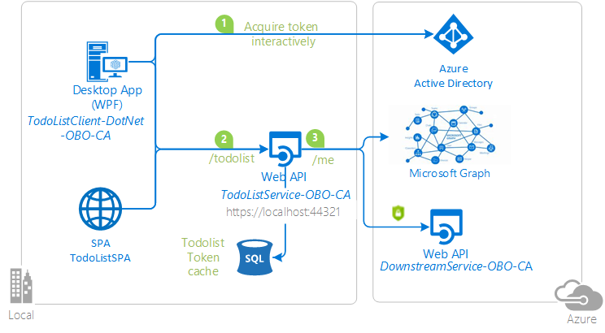
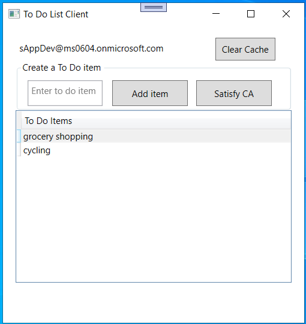

# .NET Native App accessing Web Service that calls a downstream Web API with Conditional Access


## About this Sample

The sample uses the Active Directory Authentication Library (ADAL) in a native client to obtain a token for the user to call the first web service, and also in the first web service to get a token to act on behalf of the user to call the second downstream web API.  The downstream web API will have a Conditional Access policy applied that requires Multiple Factors Authentication (MFA).

### Overview

 This sample is built on theo core [active-directory-dotnet-webapi-onbehalfof](https://github.com/Azure-Samples/active-directory-dotnet-webapi-onbehalfof) but adds support for conditional access.

As in that sample, the native client and a simple JavaScript single page application:

1. Acquire a token to act On Behalf Of the user.
2. Call a web API (`TodoListService`)
3. Which itself calls another downstream Web API (The Microsoft Graph)

But contrary to the [active-directory-dotnet-webapi-onbehalfof](https://github.com/Azure-Samples/active-directory-dotnet-webapi-onbehalfof), in this sample, moreover, the `TodoListService` Web API calls a downstream service, which requires conditional access. Therefore the intermediate service (`TodoListService`) needs to propage to its clients the need to require additional claims (for instance do two factor authentication).

Finally, as in the previous sample, the TodoListService uses a database to:

- Store the todo list
- Illustrate [token cache serialization](https://github.com/AzureAD/azure-activedirectory-library-for-dotnet/wiki/Token-cache-serialization) in a service

This sample is intended to explore the implications of using the On-Behalf-Of flow with Conditional Access. We'll walk through code changes necessary to build an app that supports Conditional Access. Simply, Azure AD will return state to the web service that needs to hand this back to the client. The client can then use this state to prompt the end user to satisfy the downstream Conditional Access policy.

> Looking for previous versions of this code sample? Check out the tags on the [releases](../../releases) GitHub page.

## Topology



This sample has three components:

\[Native App\] - - - \[Web Service\] - - - OnBehalfOf - - - \[Downstream Web API & MS Graph\]

**Native App**: Simple Windows Desktop ToDo List app that allows a user to sign in, satisfy a Conditional Access policy, and add a new task.  Once a user is signed in, the app exposes two options.  When you hit **Satisfy CA**, the client app calls Web Service to do an On-Behalf-Of flow to a CA-Protected downstream Web API 2.  The service returns an error that has to be passed back to the client and handled properly. When you select **add ToDo item**, the Web Service will do On-Behalf-Of to the Microsoft Graph rather than the CA-protected api.

**Web Service**: Service that Native app sends requests to and requires authorization via OWIN framework.  Then will perform OBO to Web API 2 if forcing MFA or OBO to the Microsoft Graph if adding a new ToDo item.

**Web API 2**: No code for this piece.  We register the app, but never call it. It exists to demonstrate token acquisition when Conditional Access is applied.

### Scenario

As in the previous sample, you sign in, and add items. You can also click on the **Satisfy CA** button, which will call an action of the `TodoListService` Web API that itself acquires a token in order to call the downstream service. As this downstream service requires MFA, the `TodoListService` will get an  that it will then propagate back to the client through the Web API response. When the `TodoListClient` desktop application received the error after calling the  `TodoListService` Web API, it extracts the additional Claims to request, and requests another token from Azure AD, with these additional claims. It can then use this token to call the `TodoListService`, and this time, this succeeds



## How to Run this Sample

To run this sample, you'll need:

- [Visual Studio 2017](https://aka.ms/vsdownload)
- An Internet connection
- An Azure Active Directory (Azure AD) tenant. For more information on how to get an Azure AD tenant, see [How to get an Azure AD tenant](https://azure.microsoft.com/en-us/documentation/articles/active-directory-howto-tenant/)
- A user account in your Azure AD tenant. This sample will not work with a Microsoft account (formerly Windows Live account). Therefore, if you signed in to the [Azure portal](https://portal.azure.com) with a Microsoft account and have never created a user account in your directory before, you need to do that now.

### Step 1:  Clone or download this repository

From your shell or command line:

```Shell
git clone https://github.com/Azure-Samples/active-directory-dotnet-webapi-onbehalfof-ca.git`
```

> Given that the name of the sample is pretty long, and so are the name of the referenced NuGet pacakges, you might want to clone it in a folder close to the root of your hard drive, to avoid file size limitations on Windows.

### Step 2:  Register the sample with your Azure Active Directory tenant

There are tree projects and four applications in this sample. Each needs to be separately registered in your Azure AD tenant. To register these projects, you can:

- either follow the steps in the paragraphs below ([Step 2](#step-2--register-the-sample-with-your-azure-active-directory-tenant) and [Step 3](#step-3--configure-the-sample-to-use-your-azure-ad-tenant))
- or use PowerShell scripts that:
  - **automatically** create for you the Azure AD applications and related objects (passwords, permissions, dependencies)
  - modify the Visual Studio projects' configuration files.

If you want to use this automation, read the instructions in [App Creation Scripts](./AppCreationScripts/AppCreationScripts.md)

#### First step: choose the Azure AD tenant where you want to create your applications

As a first step you'll need to:

1. Sign in to the [Azure portal](https://portal.azure.com).
1. On the top bar, click on your account and under the **Directory** list, choose the Active Directory tenant where you wish to register your application.
1. Click on **All services** in the left-hand nav, and choose **Azure Active Directory**.

#### Register the downstream service app (DownstreamService-OBO-CA)

1. In the  **Azure Active Directory** pane, click on **App registrations** and choose **New application registration**.
1. Enter a friendly name for the application, for example 'DownstreamService-OBO-CA' and select 'Web app / API' as the *Application Type*.
1. For the *sign-on URL*, enter the base URL for the sample, which is by default `https://localhost:44302/`.
1. Click on **Create** to create the application.
1. In the succeeding page, Find the *Application ID* value and copy it to the clipboard. You'll need it to configure the Visual Studio configuration file for this project.
1. Then click on **Settings**, and choose **Properties**.
1. For the App ID URI, replace the guid in the generated URI 'https://\<your_tenant_name\>/\<guid\>', with the name of your service, for example, 'https://\<your_tenant_name\>/DownstreamService-OBO-CA' (replacing `<your_tenant_name>` with the name of your Azure AD tenant)

#### Register the service app (TodoListService-OBO-CA)

1. In the  **Azure Active Directory** pane, click on **App registrations** and choose **New application registration**.
1. Enter a friendly name for the application, for example 'TodoListService-OBO-CA' and select 'Web app / API' as the *Application Type*.
1. For the *sign-on URL*, enter the base URL for the sample, which is by default `https://localhost:44321/`.
1. Click on **Create** to create the application.
1. In the succeeding page, Find the *Application ID* value and copy it to the clipboard. You'll need it to configure the Visual Studio configuration file for this project.
1. Then click on **Settings**, and choose **Properties**.
1. For the App ID URI, replace the guid in the generated URI 'https://\<your_tenant_name\>/\<guid\>', with the name of your service, for example, 'https://\<your_tenant_name\>/TodoListService-OBO-CA' (replacing `<your_tenant_name>` with the name of your Azure AD tenant)
1. From the Settings menu, choose **Keys** and add a new entry in the Password section:

   - Type a key description (of instance `app secret`),
   - Select a key duration of either **In 1 year**, **In 2 years**, or **Never Expires**.
   - When you save this page, the key value will be displayed, copy, and save the value in a safe location.
   - You'll need this key later to configure the project in Visual Studio. This key value will not be displayed again, nor retrievable by any other means,
     so record it as soon as it is visible from the Azure portal.
1. Configure Permissions for your application. To that extent, in the Settings menu, choose the 'Required permissions' section and then:

   - click on **Add**, then **Select an API**, and type `Microsoft Graph` in the textbox. Then, click on  **Select Permissions** and select **User.Read**.
   - click on **Add**, then **Select an API**, and type `DownstreamService-OBO-CA` in the textbox. Then, click on  **Select Permissions** and select **Access 'DownstreamService-OBO-CA'**.

#### Register the client app (TodoListClient-DotNet-OBO-CA)

1. In the  **Azure Active Directory** pane, click on **App registrations** and choose **New application registration**.
1. Enter a friendly name for the application, for example 'TodoListClient-DotNet-OBO-CA' and select 'Native' as the *Application Type*.
1. For the *Redirect URI*, enter `https://<your_tenant_name>/TodoListClient-DotNet-OBO-CA`, replacing `<your_tenant_name>` with the name of your Azure AD tenant.
1. Click on **Create** to create the application.
1. In the succeeding page, Find the *Application ID* value and copy it to the clipboard. You'll need it to configure the Visual Studio configuration file for this project.
1. Then click on **Settings**, and choose **Properties**.
1. For the App ID URI, replace the guid in the generated URI 'https://\<your_tenant_name\>/\<guid\>', with the name of your service, for example, 'https://\<your_tenant_name\>/TodoListClient-DotNet-OBO-CA' (replacing `<your_tenant_name>` with the name of your Azure AD tenant)
1. Configure Permissions for your application. To that extent, in the Settings menu, choose the 'Required permissions' section and then,
   click on **Add**, then **Select an API**, and type `TodoListService-OBO-CA` in the textbox. Then, click on  **Select Permissions** and select **Access 'TodoListService-OBO-CA'**.

#### [Optionally] Register the spa app (TodoListSPA-OBO-CA)

1. In the  **Azure Active Directory** pane, click on **App registrations** and choose **New application registration**.
1. Enter a friendly name for the application, for example 'TodoListSPA-OBO-CA' and select 'Web app / API' as the *Application Type*.
1. For the *sign-on URL*, enter the base URL for the sample, which is by default `http://localhost:16969/`.
1. Click on **Create** to create the application.
1. In the succeeding page, Find the *Application ID* value and copy it to the clipboard. You'll need it to configure the Visual Studio configuration file for this project.
1. Enable the OAuth 2 implicit grant for your application by choosing **Manifest** at the top of the application's page. Open the inline manifest editor.
   Search for the ``oauth2AllowImplicitFlow`` property. You will find that it is set to ``false``; change it to ``true`` and click on **Save** to save the manifest.
1. Then click on **Settings**, and choose **Properties**.
1. For the App ID URI, replace the guid in the generated URI 'https://\<your_tenant_name\>/\<guid\>', with the name of your service, for example, 'https://\<your_tenant_name\>/TodoListSPA-OBO-CA' (replacing `<your_tenant_name>` with the name of your Azure AD tenant)
1. Configure Permissions for your application. To that extent, in the Settings menu, choose the 'Required permissions' section and then,
   click on **Add**, then **Select an API**, and type `TodoListService-OBO-CA` in the textbox. Then, click on  **Select Permissions** and select **Access 'TodoListService-OBO-CA'**.

#### Configure known client applications for service (TodoListService-OBO-CA)

For the middle tier web API (`TodoListService-OBO-CA`) to be able to call the downstream web APIs, the user must grant the middle tier permission to do so in the form of consent.
However, since the middle tier has no interactive UI of its own, you need to explicitly bind the client app registration in Azure AD, with the registration for the web API.
This binding merges the consent required by both the client & middle tier into a single dialog, which will be presented to the user by the client.
You can do so by adding the "Client ID" of the client app, to the manifest of the web API in the `knownClientApplications` property. Here's how:

1. In the [Azure portal](https://portal.azure.com), navigate to your `TodoListService-OBO-CA` app registration, and open the manifest editor by clicking on **Manifest**.
1. In the manifest, locate the `knownClientApplications` array property, and add the
   Client ID of the client application (`TodoListClient-DotNet-OBO-CA`) as an element.
   After you're done, your code should look like the following snippet with as many GUIDs as you have clients:
   `"knownClientApplications": ["94da0930-763f-45c7-8d26-04d5938baab2"]`
1. Save the TodoListService manifest by clicking the **Save** button.

### Step 3:  Configure the sample to use your Azure AD tenant

In the steps below, ClientID is the same as Application ID or AppId.

Open the solution in Visual Studio to configure the projects

### Configure the service project

1. Open the `TodoListService\Web.Config` file
1. Find the app key `ida:Tenant` and replace the existing value with your AAD tenant name.
1. Find the app key `ida:Audience` and replace the existing value with the App ID URI you registered earlier for the TodoListService-OBO-CA app. For instance use `https://<your_tenant_name>/TodoListService-OBO-CA`, where `<your_tenant_name>` is the name of your Azure AD tenant.
1. Find the app key `ida:AppKey` and replace the existing value with the key you saved during the creation of the `TodoListService-OBO-CA` app, in the Azure portal.
1. Find the app key `ida:ClientID` and replace the existing value with the application ID (clientId) of the `TodoListService-OBO-CA` application copied from the Azure portal.
1. Find the app key `ida:CAProtectedResource` and replace the existing value with the App ID URI you registered earlier for the DownstreamService-OBO-CA app. For instance use `https://<your_tenant_name>/DownstreamService-OBO-CA`, where `<your_tenant_name>` is the name of your Azure AD tenant.

### Configure the client project

1. Open the `TodoListClient\App.Config` file
1. Find the app key `ida:Tenant` and replace the existing value with your AAD tenant name.
1. Find the app key `ida:ClientId` and replace the existing value with the application ID (clientId) of the `TodoListClient-DotNet-OBO-CA` application copied from the Azure portal.
1. Find the app key `ida:RedirectUri` and replace the existing value with the Redirect URI for TodoListClient-DotNet-OBO-CA app. For instance use `https://<your_tenant_name>/TodoListClient-DotNet-OBO-CA`, where `<your_tenant_name>` is the name of your Azure AD tenant.
1. Find the app key `todo:TodoListResourceId` and replace the existing value with the App ID URI you registered earlier for the TodoListService-OBO-CA app. For instance use `https://<your_tenant_name>/TodoListService-OBO-CA`, where `<your_tenant_name>` is the name of your Azure AD tenant.
1. Find the app key `todo:TodoListBaseAddress` and replace the existing value with the base address of the TodoListService-OBO-CA project (by default `https://localhost:44321/`).

### [Optionally] Configure the spa project

1. Open the `TodoListSPA\appconfig.js` file
1. Find the app key `tenant` and replace the existing value with your AAD tenant name.
1. Find the app key `clientId` and replace the existing value with the application ID (clientId) of the `TodoListSPA-OBO-CA` application copied from the Azure portal.
1. Find the app key `redirectUri` and replace the existing value with the base address of the TodoListSPA-OBO-CA project (by default `http://localhost:16969/`).
1. Find the app key `resourceId` and replace the existing value with the App ID URI you registered earlier for the TodoListService-OBO-CA app. For instance use `https://<your_tenant_name>/TodoListService-OBO-CA`, where `<your_tenant_name>` is the name of your Azure AD tenant.
1. Find the app key `resourceBaseAddress` and replace the existing value with the base address of the TodoListService-OBO-CA project (by default `https://localhost:44321/`).

### Step 4: Create and link a Conditional Access Policy

1. Inside the **Azure Active Directory** window, select the **Conditional access** button near the bottom of the list.
2. Go ahead and select **Add** and name your policy.
3. Select the **Users and groups** button, select **All Users** in the **Include** tab.
4. Select the **Cloud apps**, then hit the **Select apps** radio button in the **Include** tab, and select the `DownstreamCAService`.
5. Select the **Conditions** button, then hit **Client apps**, and enable **Configure** as well as select the **Select client apps** radio button and enable **Browser** and **Mobile apps and desktop clients**.
6. Finally, select the **Grant** button and hit **Allow access**. Then check the **Require multi-factor authentication** button for these tests.
7. Enable the policy and save. Access to your Web API now requires multi-factor authentication!

### Step 5:  Run the sample

Clean the solution, rebuild the solution, and run it.  You might want to go into the solution properties and set both projects as startup projects, with the service project starting first.

Explore the sample by signing in, adding items to the To Do list, removing the user account, and starting again.  The To Do list service will take the user's access token, passed from the client, and use it to perform the On-Behalf-Of flow to access the Microsoft Graph API.

If you hit the `Satisfy CA` button, the client app will do the same as above except the downstream API is not Graph.  In this case, it will request a token to the downstream web API with Conditional Access applied. The middle tier will encounter an error when attempting On-Behalf-Of, and will return back state in the `claims` parameter so the client can step up.  The user will be prompted to do MFA.

## How to deploy this sample to Azure

This project has two WebApp / Web API projects. To deploy them to Azure Web Sites, you'll need, for each one, to:

- create an Azure Web Site
- publish the Web App / Web APIs to the web site, and
- update it client(s) to call the web site instead of IIS Express.

Note that in this sample the `DownstreamService-OBO-CA` has an app registration, but does not
correspond to a project (to keep the sample simple)

### Create and Publish the `TodoListService-OBO-CA` to an Azure Web Site

1. Sign in to the [Azure portal](https://portal.azure.com).
2. Click New in the top left-hand corner, select Web + Mobile --> Web App, select the hosting plan and region, and give your web site a name, for example, `TodoListService-OBO-CA-contoso.azurewebsites.net`.  Click Create Web Site.
3. Once the web site is created, click on it to manage it.  For this set of steps, download the publish profile and save it.  Other deployment mechanisms, such as from source control, can also be used.
4. Switch to Visual Studio and go to the TodoListService project.  Right click on the project in the Solution Explorer and select Publish.  Click Import, and import the publish profile that you downloaded.
5. On the Connection tab, update the Destination URL so that it is https, for example [https://TodoListService-OBO-CA-contoso.azurewebsites.net](https://TodoListService-OBO-CA-contoso.azurewebsites.net). Click Next.
6. On the Settings tab, make sure Enable Organizational Authentication is NOT selected.  Click Publish.
7. Visual Studio will publish the project and automatically open a browser to the URL of the project.  If you see the default web page of the project, the publication was successful.

### Update the Active Directory tenant application registration for `TodoListService-OBO-CA`

1. Navigate to the [Azure portal](https://portal.azure.com).
2. On the top bar, click on your account and under the **Directory** list, choose the Active Directory tenant containing the `TodoListService-OBO-CA` application.
3. On the applications tab, select the `TodoListService-OBO-CA` application.
4. From the Settings -> Properties and Settings -> Reply URLs menus, update the Sign-On URL, and Reply URL fields to the address of your service, for example [https://TodoListService-OBO-CA-contoso.azurewebsites.net](https://TodoListService-OBO-CA-contoso.azurewebsites.net). Save the configuration.

### Update the `TodoListClient-DotNet-OBO-CA` to call the `TodoListService-OBO-CA` Running in Azure Web Sites

1. In Visual Studio, go to the `TodoListClient-DotNet-OBO-CA` project.
2. Open `TodoListClient\App.Config`.  Only one change is needed - update the `todo:TodoListBaseAddress` key value to be the address of the website you published,
   for example, [https://TodoListService-OBO-CA-contoso.azurewebsites.net](https://TodoListService-OBO-CA-contoso.azurewebsites.net).
3. Run the client! If you are trying multiple different client types (for example, .Net, Windows Store, Android, iOS) you can have them all call this one published web API.

### {Optionally] Update the `TodoListSPA-OBO-CA` to call the `TodoListService-OBO-CA` Running in Azure Web Sites

1. In Visual Studio, go to the `TodoListSPA-OBO-CA` project.
2. Open `TodoListSPA\appconfig.js`.  Only one change is needed - update the `todo:TodoListBaseAddress` key value to be the address of the website you published,
   for example, [https://TodoListService-OBO-CA-contoso.azurewebsites.net](https://TodoListService-OBO-CA-contoso.azurewebsites.net).
3. Run the client! If you are trying multiple different client types (for example, .Net, Windows Store, Android, iOS) you can have them all call this one published web API.

### {Optionally] Create and Publish the `TodoListSPA-OBO-CA` to an Azure Web Site

1. Sign in to the [Azure portal](https://portal.azure.com).
2. Click New in the top left-hand corner, select Web + Mobile --> Web App, select the hosting plan and region, and give your web site a name, for example, `TodoListSPA-OBO-CA-contoso.azurewebsites.net`.  Click Create Web Site.
3. Once the web site is created, click on it to manage it.  For this set of steps, download the publish profile and save it.  Other deployment mechanisms, such as from source control, can also be used.
4. Switch to Visual Studio and go to the TodoListService project.  Right click on the project in the Solution Explorer and select Publish.  Click Import, and import the publish profile that you downloaded.
5. On the Connection tab, update the Destination URL so that it is https, for example [https://TodoListSPA-OBO-CA-contoso.azurewebsites.net](https://TodoListSPA-OBO-CA-contoso.azurewebsites.net). Click Next.
6. On the Settings tab, make sure Enable Organizational Authentication is NOT selected.  Click Publish.
7. Visual Studio will publish the project and automatically open a browser to the URL of the project.  If you see the default web page of the project, the publication was successful.

### {Optionally] Update the Active Directory tenant application registration for `TodoListSPA-OBO-CA`

1. Navigate to the [Azure portal](https://portal.azure.com).
2. On the top bar, click on your account and under the **Directory** list, choose the Active Directory tenant containing the `TodoListSPA-OBO-CA` application.
3. On the applications tab, select the `TodoListSPA-OBO-CA` application.
4. From the Settings -> Properties and Settings -> Reply URLs menus, update the Sign-On URL, and Reply URL fields to the address of your service, for example [https://TodoListSPA-OBO-CA-contoso.azurewebsites.net](https://TodoListSPA-OBO-CA-contoso.azurewebsites.net). Save the configuration.

## About the Code

This code builds on top of the [active-directory-dotnet-webapi-onbehalfof](https://github.com/Azure-samples/active-directory-dotnet-webapi-onbehalfof) sample, but adds support for conditional access.

In the Native App:

**MainWindow.xaml.cs**: The method SignInCA method to understand how the client handles the claim param.  Here you can see the necessary client code to handle a Conditional Access claims challenge and construct a new request.

In the Web Service:

**AccessCaApiController.cs**: Check out the HTTP GET endpoint in this controller to see how we initiate and handle the `interaction_required` error. Specifically, the code attempts to get a token for the downstream service On-Behalf-Of the user.  When the claims challenge is generated, this method will parse the exception and return back to the client the claims parameter so it can step up.

## Community Help and Support

Use [Stack Overflow](http://stackoverflow.com/questions/tagged/adal) to get support from the community.
Ask your questions on Stack Overflow first and browse existing issues to see if someone has asked your question before.
Make sure that your questions or comments are tagged with [`adal` `dotnet`].

If you find a bug in the sample, please raise the issue on [GitHub Issues](../../issues).

To provide a recommendation, visit the following [User Voice page](https://feedback.azure.com/forums/169401-azure-active-directory).

## Contributing

If you'd like to contribute to this sample, see [CONTRIBUTING.MD](/CONTRIBUTING.md).

This project has adopted the [Microsoft Open Source Code of Conduct](https://opensource.microsoft.com/codeofconduct/). For more information, see the [Code of Conduct FAQ](https://opensource.microsoft.com/codeofconduct/faq/) or contact [opencode@microsoft.com](mailto:opencode@microsoft.com) with any additional questions or comments.

## More information

For more information, see ADAL.NET's conceptual documentation:
For the TodoList client:

- [Recommended pattern to acquire a token](https://github.com/AzureAD/azure-activedirectory-library-for-dotnet/wiki/AcquireTokenSilentAsync-using-a-cached-token#recommended-pattern-to-acquire-a-token)
- [Acquiring tokens interactively in public client applications](https://github.com/AzureAD/azure-activedirectory-library-for-dotnet/wiki/Acquiring-tokens-interactively---Public-client-application-flows)

For the Todo List Service:

- [Service to service calls on behalf of the user](https://github.com/AzureAD/azure-activedirectory-library-for-dotnet/wiki/Service-to-service-calls-on-behalf-of-the-user).

For both:

- [Customizing Token cache serialization](https://github.com/AzureAD/azure-activedirectory-library-for-dotnet/wiki/Token-cache-serialization)
- For more information about how the protocols work in this scenario and other scenarios, see [Authentication Scenarios for Azure AD](http://go.microsoft.com/fwlink/?LinkId=394414).
- To learn more about Conditional Access, checkout [Conditional Access in Azure AD](https://docs.microsoft.com/en-us/azure/active-directory/active-directory-conditional-access).
